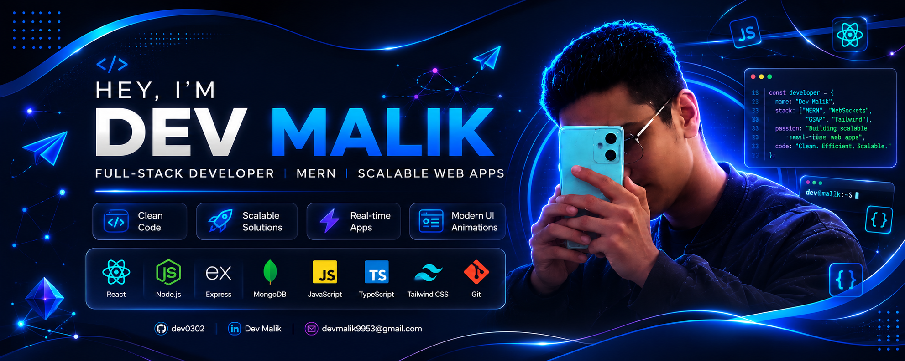
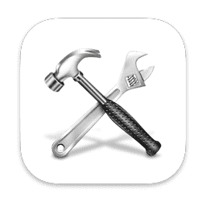
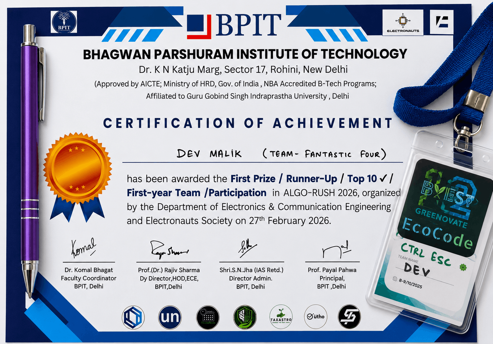
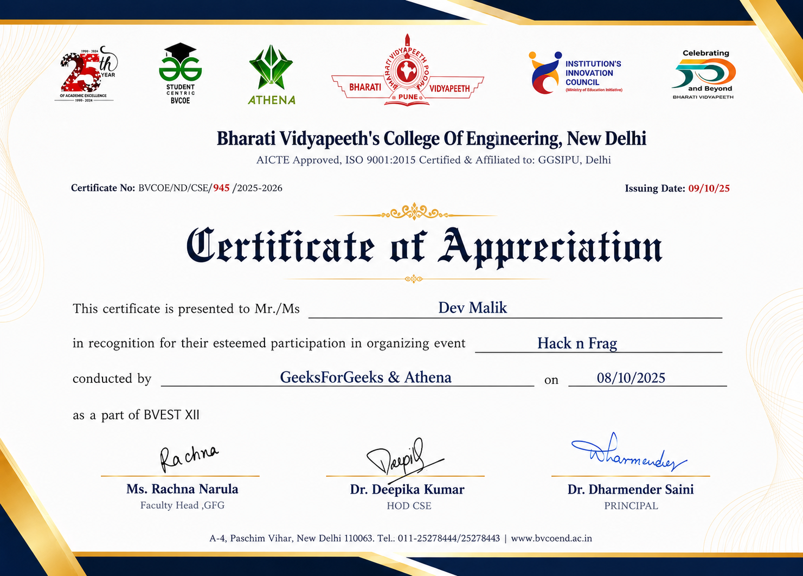
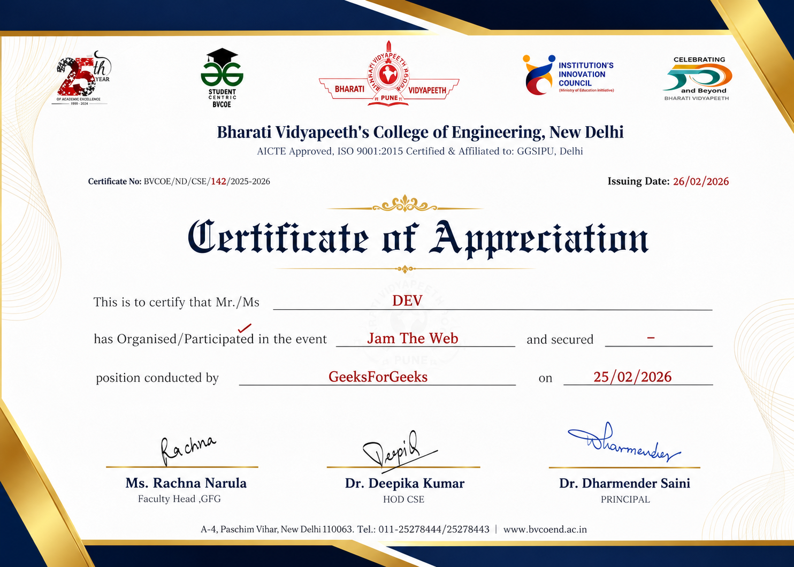
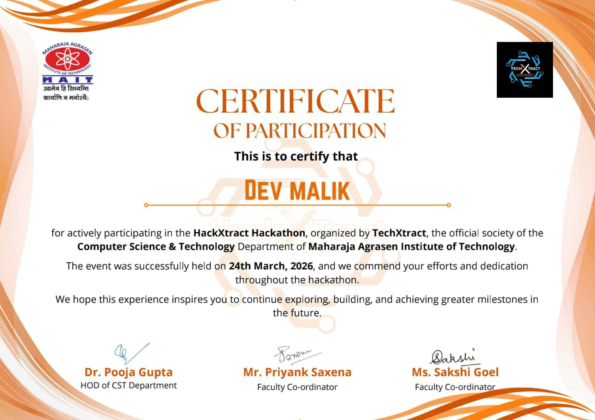

  

<h1 align="center">Hey 👋, I'm Dev Malik</h1>
<h3 align="center">Full-Stack Developer | MERN | Scalable Web Apps</h3>

  

   

---

<h2>
  
  About Me
</h2>

  &nbsp;&nbsp;&nbsp;&nbsp;
  
  <strong>Focused on</strong> Full-Stack Web Development

  &nbsp;&nbsp;&nbsp;&nbsp;
  
  <strong>Exploring</strong> scalable backend systems & deployment

  &nbsp;&nbsp;&nbsp;&nbsp;
  
  <strong>Ask me about</strong> MERN, APIs, databases, and real-time applications

  &nbsp;&nbsp;&nbsp;&nbsp;
  
  <strong>Email:</strong> devmalik9953@gmail.com

  &nbsp;&nbsp;&nbsp;&nbsp;
  
  <strong>Fun Fact:</strong> <em>I love turning complex logic into elegant solutions.</em>

---

<h2>  Tech Stack </h2>

### 👨‍💻 Languages

  

### 🎨 Frontend

  
  
   

### ⚙️ Backend

  

### 🗄️ Databases & ORM

  
  

### 🔌 Real-Time & Animations

  
  &nbsp;&nbsp;
  
  &nbsp;&nbsp;
  

### 🧰 Tools & Platforms

  

---

## 📊 GitHub Stats

  

 

  
  &nbsp;&nbsp;&nbsp;&nbsp;
  

  

  

---

## 🐍 Contribution Activity

  

---

## 🏆 LeetCode Analytics

  

  

## 🏆 Certificates & Achievements

<table>
<tr>
<td align="center">
  
</td>
<td align="center">
  
</td>
<td align="center">
  
</td>
</tr>

<tr>
<td align="center">
  
</td>
  
<td></td>
<td></td>
</tr>
</table>

---

## 🌐 Connect With Me

  
  &nbsp;&nbsp;&nbsp;&nbsp;
  
  &nbsp;&nbsp;&nbsp;&nbsp;
  
  &nbsp;&nbsp;&nbsp;&nbsp;
  

  <b>Let's connect and build something amazing together.</b>

---

  
  <b>Thanks for visiting my profile! Explore my repositories and don't forget to ⭐ your favorites.</b>

